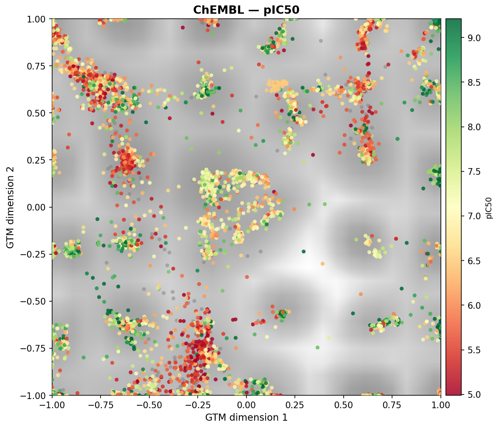

# GTM Toolkit - Generative Topographic Mapping for Chemical Space Analysis

## Why GTM?

GTM offers several properties that make it well-suited for chemical space analysis in drug discovery, distinguishing it from commonly used alternatives such as t-SNE, UMAP, or PCA:

- **Stable, reusable map**: GTM trains a fixed generative model. Once trained, new compounds can be projected onto the exact same 2D grid without retraining, enabling fair longitudinal comparisons across different datasets and time points.
- **Probabilistic framework**: Each molecule is assigned a responsibility distribution over grid nodes, not just a single point. This makes projection confidence quantifiable (via entropy) and supports robust density estimation.
- **Density-preserving layout**: The map is defined on a regular grid, so density maps, enrichment ratios, and coverage metrics are directly comparable between datasets without normalization artifacts.
- **Interpretable geometry**: Unlike t-SNE or UMAP, GTM does not distort global distances arbitrarily. Regions on the map retain a consistent meaning, and similar regions across separate projections correspond to the same latent coordinates.
- **Scalable to large libraries**: The chunked projection pipeline handles millions of compounds without loading all fingerprints into memory at once.
- **Fingerprint-agnostic**: Works with any bit-vector or count-vector fingerprint (ECFP, FCFP, MACCS, RDKit, etc.), and variance filtering + PCA preprocessing handles high-dimensional, sparse inputs efficiently.
- **Quantitative post-analysis**: Saved coordinate arrays support downstream analysis (coverage, diversity, enrichment, clustering) fully decoupled from the training step.


Inspired by [Horvath, Marcou, Varnek. "Generative topographic mapping in drug design." Drug Discovery Today: Technologies 32 (2019): 99-107.](https://www.sciencedirect.com/science/article/pii/S1740674920300044).

This repository provides reusable Generative Topographic Mapping (GTM) workflows for projecting high-dimensional molecular fingerprints into a stable 2D latent space and comparing datasets on that shared map.

You can use it for many scenarios, including:

- reference vs query library comparison
- novelty and coverage analysis
- activity/property landscape visualization
- reusable map training and fast projection of new batches

Based on Bishop & Svensén (1998) algorithm. 


## Examples




## Main components

- `gtm_large_spaces.py`: scalable CLI pipeline for train/project/compare
- `explore_gtm_results.py`: quantitative post-analysis from saved coordinates
- `gtm_chemical_space_analysis.ipynb`: end-to-end notebook workflow (target-focused analysis with activity overlays and diagnostics)
- `gtm_chem/`: GTM model, fingerprinting, PCA/filtering, plotting utilities
- `interactive/`: interactive Dash web app for visual exploration of GTM maps

## Prerequisites

- Python 3.10+ recommended
- RDKit-compatible environment
- Input files in SMILES or SDF format

## Install dependencies

Download or clone this repository, then set up a Python environment with the required packages.

### Option A (recommended): conda-forge

```bash
conda create -n gtm-chem python=3.11 -y
conda activate gtm-chem
conda install -c conda-forge rdkit numpy scipy scikit-learn matplotlib pandas -y
pip install hdbscan
```

### Option B: pip

```bash
python -m venv .venv
source .venv/bin/activate
pip install --upgrade pip
pip install numpy scipy scikit-learn matplotlib pandas rdkit-pypi hdbscan
```

## Input format

### SMILES mode (`--format smi`, default)

- one molecule per line
- first token = SMILES
- optional second token (name/id) is allowed and ignored by the parser

### SDF mode (`--format sdf`)

- use when both inputs are SDF files

## CLI workflow

### 1. Train/load GTM, project datasets, generate core maps

```bash
python gtm_large_spaces.py \
  --lib1 /path/to/reference.smi \
  --lib2 /path/to/query.smi \
  --label-lib1 reference \
  --label-lib2 query \
  --fp ecfp4 \
  --subsample 100000 \
  --chunk 50000 \
  --pca 50 \
  --grid 25 \
  --rbf 6 \
  --n-iter 200 \
  --outdir gtm_output
```

What it does:

1. samples training molecules (`--train_on` supports `lib1`, `lib2`, or `mix`)
2. variance filters fingerprints and fits PCA
3. trains GTM (or loads existing artifacts)
4. projects all molecules in chunks
5. writes coordinate arrays + comparison figures

Reuse behavior:

- existing model/PCA/mask are reused unless `--retrain` is passed
- existing coordinate files are reused unless `--reproject` is passed

### 2. Run deeper exploratory analysis

```bash
python explore_gtm_results.py \
  --outdir gtm_output \
  --label-lib1 reference \
  --label-lib2 query \
  --bins 300 \
  --smooth 1.5 \
  --nn-sample 50000 \
  --cluster-min-size 500
```

This uses the saved `coords_<label>.npy` files and produces coverage, enrichment, diversity, cluster, radial, and summary analyses.

### 3. Interactive map explorer (Dash)

The `interactive/` directory contains a Dash web app for visual exploration of GTM results. It provides:

- **Dual-panel view:** left panel shows the GTM landscape heatmap with compound points colored by pIC50; right panel shows compound points only
- **Linked zoom/pan:** both panels stay synchronized during navigation
- **Hover card:** hover over any point to see the compound structure, label, and pIC50

#### Pipeline: from GTM output to interactive app

```
gtm_large_spaces.py  →  coords_*.npy + notebook/pipeline outputs
         ↓
  prepare_data.py     →  data/points.parquet  [+ data/landscape.npz]
         ↓
    app_v3.py         →  http://127.0.0.1:8050
```

**Step 1 — install app dependencies:**

```bash
pip install -r interactive/requirements.txt
```

Also requires RDKit (install via conda-forge as above).

**Step 2 — prepare data:**

If you have a CSV or Parquet file with columns `x`, `y`, `label`, `smiles`, `pIC50`:

```bash
python interactive/prepare_data.py \
  --infile your_points.csv \
  --out-dir interactive/data
```

Optional: pass `--landscape-npz landscape.npz` to include a background heatmap (`xgrid`, `ygrid`, `z` arrays).

You can also call `export_from_dataframe(...)` directly from your analysis pipeline to skip the CLI step.

**Step 3 — launch the app:**

```bash
python interactive/app_v3.py \
  --data-dir interactive/data \
  --port 8050
```

Then open http://127.0.0.1:8050 in your browser.

**Expected data schema for `points.parquet` / `points.csv`:**

| column | type | description |
|--------|------|-------------|
| `x` | float | GTM coordinate |
| `y` | float | GTM coordinate |
| `label` | str | compound ID |
| `smiles` | str | SMILES string |
| `pIC50` | float | activity value |

Extra columns are preserved and can be shown in the hover card.

## Notebook workflow and use cases

`gtm_chemical_space_analysis.ipynb` is a guided, configurable workflow intended for interactive analysis and reporting.

Primary notebook use cases:

- train a target-specific GTM reference map from curated activity data (example: ChEMBL export)
- project your own compounds onto the fixed reference map
- build activity landscapes (for example pIC50/pKi maps)
- assess novelty vs known chemical space using overlay plots
- quantify projection confidence via responsibility entropy
- save a reusable trained GTM model for future projection-only runs

Notebook outputs include:

- `gtm_reference_model.pkl`
- `gtm_activity_landscape.png`
- `gtm_overlay.png`
- `gtm_diagnostics.png`

The notebook is best when you want:

- transparent data cleaning and deduplication steps
- target/domain-specific customization
- exploratory interpretation with inline figures

Use CLI scripts when you want batch or large-scale automated runs.

## Key CLI options

### `gtm_large_spaces.py`

- `--lib1`, `--lib2`: input dataset files
- `--format {smi,sdf}`: input format for both files
- `--label-lib1`, `--label-lib2`: labels used in plots and coordinate filenames
- `--train_on {lib1,lib2,mix}`: source for training subsample
- `--fp`: fingerprint type (`ecfp4`, `ecfp6`, `fcfp4`, `fcfp6`, `maccs`, `rdkit`, `torsion`, `atompair`, ...)
- `--subsample`: training sample size
- `--chunk`: projection chunk size
- `--pca`: PCA dimensions
- `--grid`: latent grid size
- `--rbf`: RBF grid size
- `--n-iter`: EM iterations
- `--bins`, `--smooth`, `--coverage-threshold`: visualization controls
- `--outdir`: output directory
- `--retrain`, `--reproject`: force recomputation

### `explore_gtm_results.py`

- `--outdir`: directory containing coordinate files and output images
- `--label-lib1`, `--label-lib2`: coordinate filename labels
- `--bins`, `--smooth`: density analysis settings
- `--nn-sample`: sampling size for nearest-neighbor diversity metrics
- `--cluster-min-size`: cluster analysis threshold parameter

### `interactive/prepare_data.py`

- `--infile`: input CSV or Parquet file
- `--out-dir`: output directory for app data files (default: `data`)
- `--x-col`, `--y-col`, `--label-col`, `--smiles-col`, `--p-col`: column name overrides
- `--landscape-npz`: optional NPZ file with `xgrid`, `ygrid`, `z` arrays

### `interactive/app_v3.py`

- `--data-dir`: directory containing `points.parquet` and optionally `landscape.npz`
- `--port`: port to serve the app on (default: 8050)

## Output artifacts

From `gtm_large_spaces.py`:

- `gtm_model.pkl`
- `pca_model.pkl`
- `var_mask.npy`
- `gtm_convergence.png` (when training is performed)
- `coords_<label-lib1>.npy`
- `coords_<label-lib2>.npy`
- `density_side_by_side.png`
- `logratio_map.png`
- `contour_overlay.png`
- `coverage_map.png`

From `explore_gtm_results.py`:

- `explore_coverage.png`
- `explore_quadrant.png`
- `explore_radial.png`
- `explore_clusters.png`
- `explore_diversity.png`
- `explore_summary.png`

From `interactive/prepare_data.py`:

- `points.parquet`
- `landscape.npz` (optional)

## Quick checks

```bash
python gtm_large_spaces.py --help
python explore_gtm_results.py --help
python interactive/prepare_data.py --help
python interactive/app_v3.py --help
```

## Troubleshooting

- `ModuleNotFoundError: rdkit`: use conda-forge RDKit install
- missing `coords_<label>.npy`: run `gtm_large_spaces.py` first and ensure labels match
- memory/runtime issues: reduce `--subsample`, `--chunk`, and/or `--bins`
- app shows no points: verify `points.parquet` exists in `--data-dir` and columns match expected schema

## Disclaimer

This software is provided **as is**, without warranty of any kind, express or implied, including but not limited to the warranties of merchantability, fitness for a particular purpose, and non-infringement. In no event shall the authors or contributors be liable for any claim, damages, or other liability, whether in an action of contract, tort, or otherwise, arising from, out of, or in connection with the software or the use or other dealings in the software.